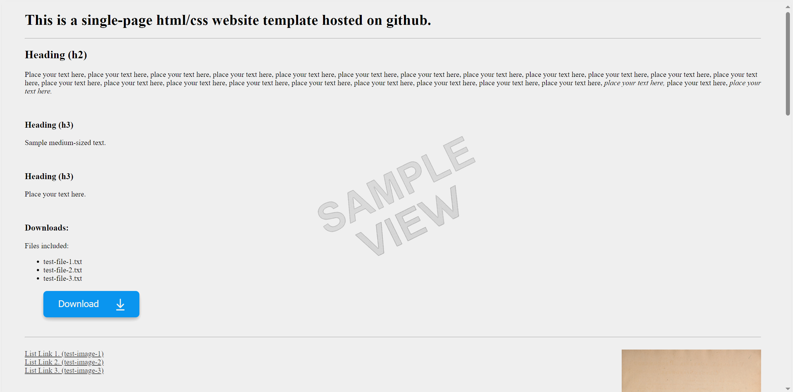

### This GitHub repository is being used to host the website:

# website-template-simple-single-page-v1

* [Click this link to visit and try the website being created from this repository and hosted on github-pages.](https://boxbot6.github.io/website-template-simple-single-page-v1/)

 

## To Use the Template:
* Create a new folder on your computer and name it - this folder will be your new websites main root directory folder.
* Use the green '\<\> Code' button at the top of this repository's page in github to 'Download ZIP' of this repository.
* Unzip and copy all the downloads contents to the new root directory folder keeping its folder layout intact.
* This folder now contains your new website ready to be personalised by editing the contents as outlined in the section below and when you are happy with the results you can host it for free on GitHub (see 'Using Free Github Hosting' section below) or simply move the complete new root directory folder to wherever else you wish to host it.

## To Edit the Website:
* Open the copied index.html file from inside your new root directory folder (using Notepad or another html editor) and edit the contents to create your own home page (A good beginners guide here: [HTML For Beginners The Easy Way: Start Learning HTML & CSS Today](https://html.com/)).
* (To test the website as you are editing it - click the index.html file and it should automatically open a browser window and show the results of your current edits - refresh this window to update subsequent edits). 
* Add any images you wish to use to the images folder.
* Update and check all the new links are working (see the links already included in the template for examples).
* Edit the .css file to change the website appearance and styles.
* Delete or \<\!\-\- comment out \-\-\> anything not needed.
* Edit the index.html files for any other pages if your website has more than one page (each pages index.html is located in their own subdirectory folder) - add your own content to each of these subsequent pages.
* When you are happy with everything upload or move the main root directory folder to where you wish to host it.

## Using Free Github Hosting: (size/usage limits)
* Sign in to your account on [Github.com](https://github.com/), go to 'Your repositories' and select 'New' (top right).
* In 'create a new repository' give the new repository a name (this name also applies to your website), add an optional description if you want, keep check box 'Public' to make your repository and website visible to the general public online. (don't add a README file, .gitignore or Licence here, the relevant files will be added later).
* Press 'Create repository' at the bottom.
* This will take you to Quick setup, select 'uploading an existing file'
* On the next page that appears, drag and drop all the internal files and folders together from inside the new root directory folder that you made in 'To Use the Template' onto the upload section.
* Press 'Commit changes' at the bottom.
* Check the new repository is shown to be Public (if not change the visibility in settings).
* Change the Licence now if you want to.
* Now use 'Settings' to open GitHub Pages (shown as Pages at the bottom of 'Code and automation' in the menu column on the left).
* Select Source - Deploy from a branch, select main, then save.
* Wait a few minutes for the website to be created - when its done the https address will be shown in github-pages - copy the link and update the README.md file to show the name of your new website and update the link to the one given for your new site.

 

(After creating your own website using this template and github-pages you can replace this README.md with something similar to that shown below but using your own sites name - update the https link beneath it to take you to your new websites address (you can find your new sites address by looking in Settings > Pages (github-pages)) - you can then delete all these comments above!)

 

### This GitHub repository is being used to host the website:

# your-website-name-here

 

* [Click this link to visit the website being created from this repository and hosted on github-pages.](https://boxbot6.github.io/website-template-simple-single-page-v1/)

 

---

* [Click this link to see more templates.](https://boxbot6.github.io/simple-website-templates/)

 
